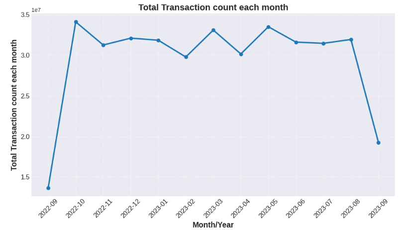
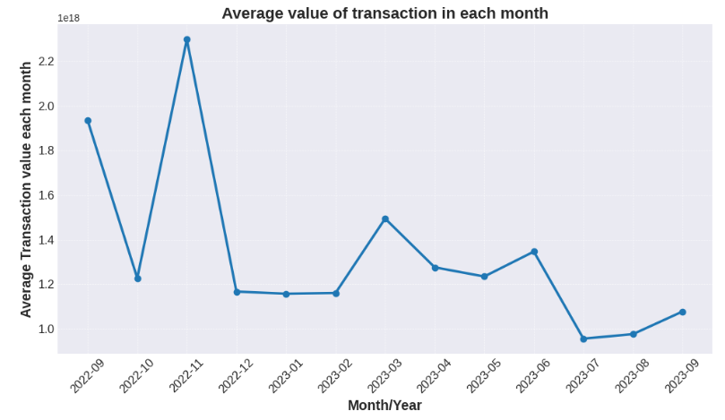

# Ethereum Data Engineering Pipeline: Deep Dive Analysis 🚀

Welcome to the repository of my Ethereum Cryptocurrency Analysis! This project embodies a series of in-depth analyses on Ethereum transactions using data from Google BigQuery, processed in a Dataproc cluster with Pyspark, and executed in a Vertex AI managed notebook.

## 🌟 Overview:

**Project Scope:**
- Visualization of Ethereum transaction trends.
- Evaluation of top Ethereum smart contracts based on Ether received.
- Identification of leading Ethereum miners.
- Assessment of data overhead in Ethereum blocks.
- Monitoring the gas consumption pattern of smart contracts over time.

## 📌 Analysis Breakdown:

### 📊 Transaction Trends:
**Objective**: To unearth the trends in Ethereum transactions over time, showcased via bar plots.
- 
- 
  
[More Details](#analysis-based-on-transactions)

### 📈 Top 10 Smart Contracts:
**Objective**: Identify the top 10 smart contracts that have received the highest Ether.
- [Results: Top 10 Smart Contracts](outputs/top_smart_contracts.txt)

[More Details](#objectives)

### 🏆 Top 10 Miners:
**Objective**: List the top miners based on the total block sizes they've mined.
- [Results: Console Output](#top-10-miners)

### 💼 Data Overhead Analysis:
**Objective**: Estimation of space savings by pruning specific columns from the cryptocurrency blocks table.
- [Results: Console Output](#data-overhead-analysis)

### ⛽ GAS Guzzlers:
**Objective**: Examine the changes in gas price & gas used for Ethereum's contract transactions.
- [Average Gas Price](outputs/avg_gas_price.txt)
- [Average Gas Used for Contracts](outputs/avg_gas_used.txt)

[More Details](#gas-guzzlers)

## 🚀 Tech Stack:
- **Data Source**: Google BigQuery
- **Processing Engine**: PySpark on Dataproc Cluster
- **Execution Environment**: Vertex AI Managed Notebook

---

### 📂 Project Structure:
