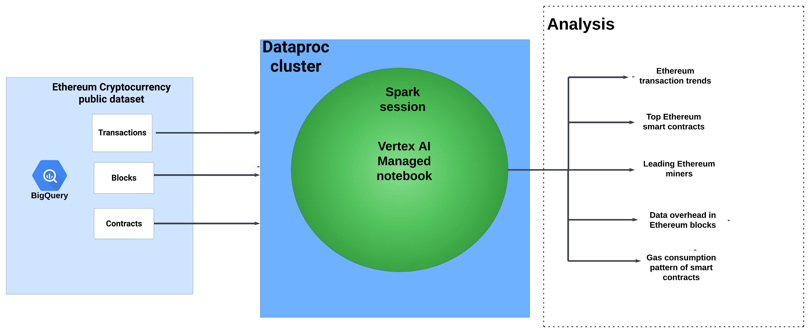

# Ethereum Data Engineering Pipeline: Deep Dive Analysis 🚀

Welcome to the repository of my Ethereum Cryptocurrency Analysis! This project embodies a series of in-depth analyses on Ethereum transactions using data from Google BigQuery, processed in a Dataproc cluster with Pyspark, and executed in a Vertex AI managed notebook.

## 🌟 Overview:

**Project Scope:**
- Visualization of Ethereum transaction trends.
- Evaluation of top Ethereum smart contracts based on Ether received.
- Identification of leading Ethereum miners.
- Assessment of data overhead in Ethereum blocks.
- Monitoring the gas consumption pattern of smart contracts over time.

## Dataset Overview
- **Timeline**: September 2022 to September 2023 (Last 1 year)
- **Size**:
  - **Blocks**: 2.61 million records
  - **Contracts**: 12.06 million records
  - **Transactions**: 383.94 million records

## [CHECK MY JUPYTER NOTEBOOK FOR MORE DETAILS](etherium-data-analysis.ipynb)

## 📌 Analysis Breakdown:

###  Architecture

### 📊 Transaction Trends:
**Objective**: To unearth the trends in Ethereum transactions over time, showcased via bar plots.
- [Monthly Transaction Count Plot](outputs/monthly_transaction_count.png)
- [Monthly Average Transaction Value Plot](outputs/monthly_avg_transaction_value.png)
  

### 📈 Top 10 Smart Contracts:
**Objective**: Identify the top 10 smart contracts that have received the highest Ether.
- [Results: Top 10 Smart Contracts](outputs/top_smart_contracts.txt)

### 🏆 Top 10 Miners:
**Objective**: List the top miners based on the total block sizes they've mined.
- [Results: Console Output](outputs/Top_10_Miners.txt)

### 💼 Data Overhead Analysis:
**Objective**: Estimation of space savings by pruning specific columns from the cryptocurrency blocks table.
- [Results: Console Output](outputs/Data_Overhead.txt)

### ⛽ GAS Guzzlers:
**Objective**: Examine the changes in gas price & gas used for Ethereum's contract transactions.
- [Average Gas Price](outputs/average_gas_price_each_month.png)
- [Average Gas Used for Contracts](outputs/Average_gas_used_each_month.png)

## 🚀 Tech Stack:
- **Data Source**: Google BigQuery
- **Processing Engine**: PySpark on Dataproc Cluster
- **Execution Environment**: Vertex AI Managed Notebook

---

🙋 Feedback:
Feel free to raise issues or provide feedback to enhance this project. If you find this repository useful, please consider giving it a ⭐!